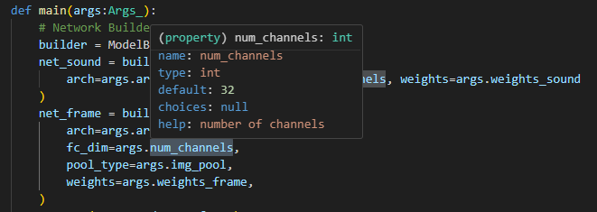
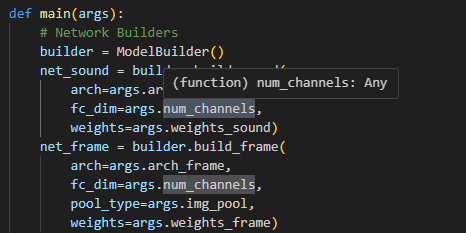

## IQuery Example

The codes from [IQuery repository](https://github.com/JiabenChen/iQuery) is far from Clean Code.

This module is to automate the generation of `informative data classes`.

The `args` variable is everywhere in the repository, but no information is accessible. It makes it extremely hard to understand the codes.

The problem can be completely solved using this `auto-props` library.

Check the examples

[Original Code](./annotated/main_ave_original.py)\
[Annotated Code](./annotated/main_ave_annotated.py)
